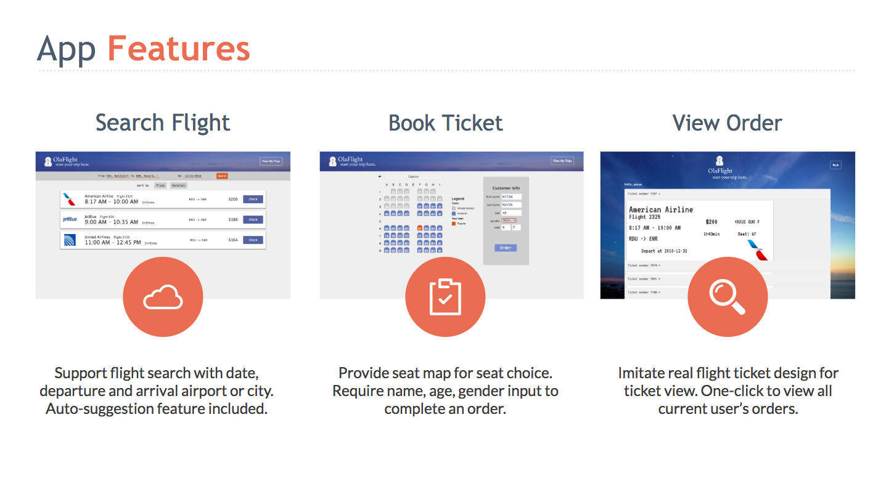
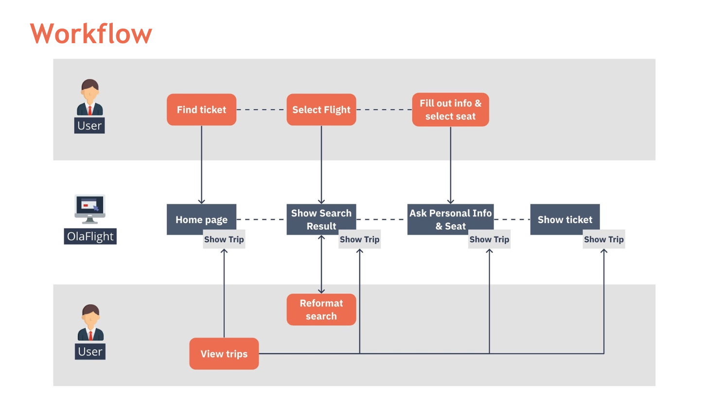
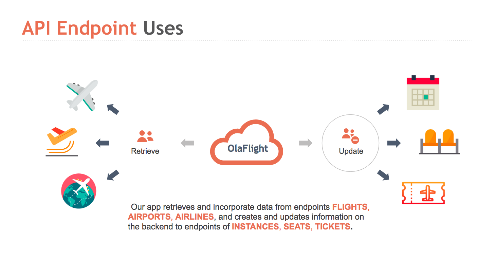
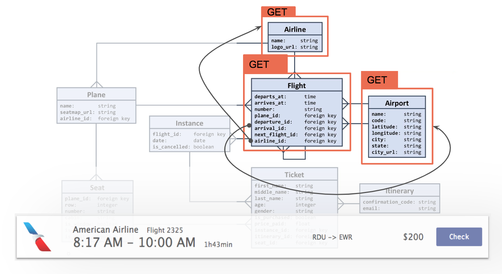
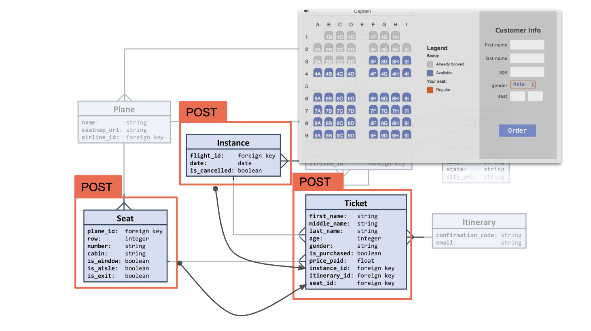
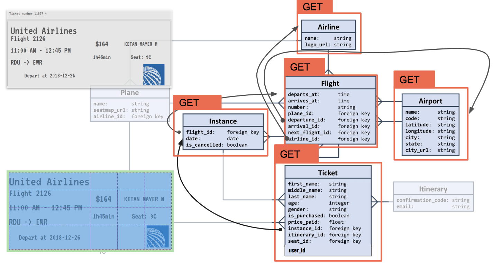
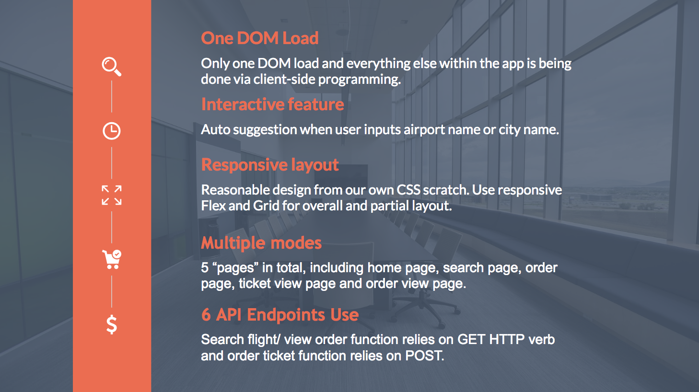
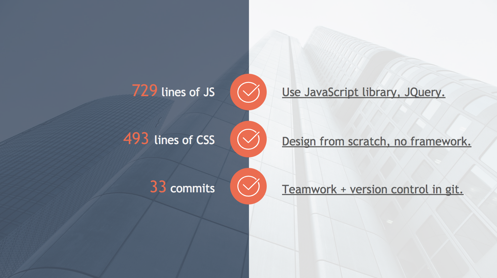
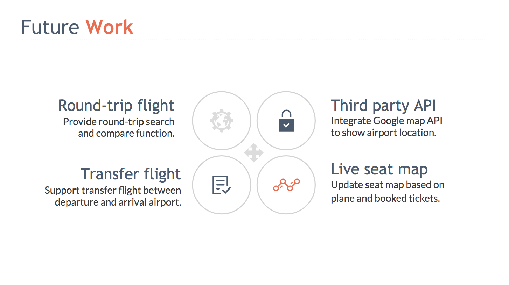

# Olafight Flight Ticket Booking Web Application ⛄️

This web app is the final project of 2018 FALL *COMP 426 Modern Web Programming* at UNC-CH. Olaflight can help you search flight, book ticket and view order history. 

## Getting Started

UNC on-campus network required to view the live version of our app.

## Static Introduction 

## Authors

* **Yaxue Guo** - mainly RESTful API use, back-end logic. 

* **Yu Yuan** - mainly UI design and development.

## Acknowledgements

This app is based on the Flights API developed by Aaron Smith, TA for COMP 426 at UNC-CH.
